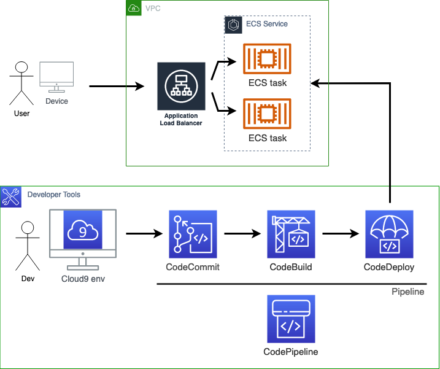
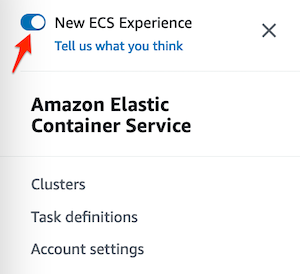
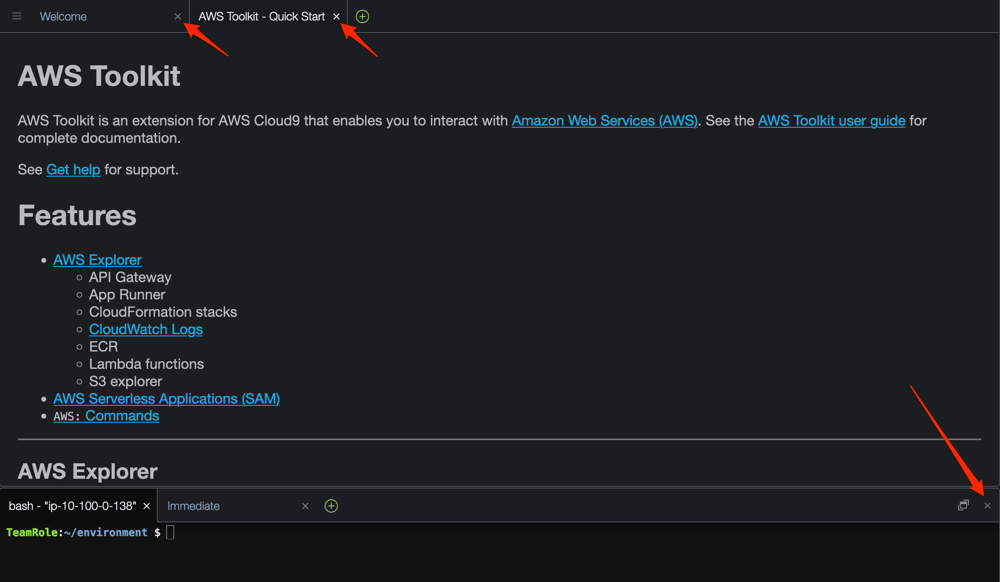
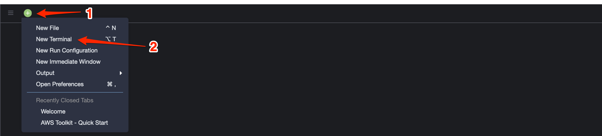
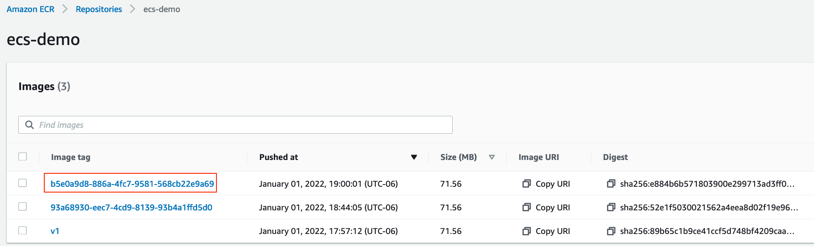
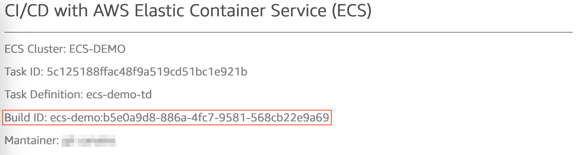

# CI/CD DEMO WITH AWS ECS

In this lab you will use the AWS Development Tools to create a CI/CD pipeline to mantain an containerized application updated in a continuous and managed way.

This diagram represent the lab's final architecture:



You will deploy and configure the following AWS managed services:

- CodeCommit
- CodeBuild
- CodeDeploy
- Cloud9
- Elastic Container Service (ECS)
- Elastic Container Registry (ECR)

## Task 1: Deploy CloudFormation template

In this fist task will create the environment resources required to create the CI/CD pipeline deploying a CloudFormation template.

The following resources will be created as part of the CloudFormation stack deployment.

- VPC
- ECS Fargate cluster
- ECS task definition
- Elastic Container Registry (ECR) repository
- CodeCommit repository
- Cloud9 environment
- Application Load Balancer
- CloudWatch log group
- IAM roles and policies

1. Download CloudFormation template file `CF-ecs-cicd-demo.template`

1. Before start this lab, make sure your console default region is **Ohio (us-east-2)**

1. Go to **Services** > **CloudFormation**

1. Click on **Create stack**

1. In the the **Specify template** section, click on the **Upload a template file** radio button.

1. Click on **Choose file**

1. Navigateo to the CloudFormation template file you just downloaded. Select the file and click on **Open**.

1. Click **Next**

1. In the **Stack name** section, type a name for the stack (i.e. "CICD-demo").

1. Click **Next**

1. In the **Configure stack options** page, click on **Next**

1. In the **Review <stack-name>** page scroll to the end of the page, in the section under **Capabilities** check the box next to **I acknowledge that AWS CloudFormation might create IAM resources with custom names.**

1. Click on **Create stack**.

    Stack deploymente will take ~7 minutes, please wait until completion. Once completed click on the stack's **Outputs** tab and copy the URL value from the `LoadBalancerDns` key and paste it in a notepad.

## Task 2: Create **ECS** Service

In this task you will create the **ECS Service** which will host the application.

1. Go to **Services** > **Elastic Container Service**

1. Make sure you are using the latest console version **New ECS Experience**. Click on the three horizontal lines at the top left corner of the console to make sure it's enabled.

    

1. First confirm a Docker image has been pushed to the ECR repo `ecs-demo`. This image was created and pushed to ECR at CloudFormation stack deployment and will be used to create the first version of the web app. From the ECS console left panel, under **Amazon ECR**, click on **Repositories**. Repo is called `ecs-demo`, click on the repo name link and you must notice an image tagged as `v1`.

            The CloudFormation stack has already created a task definition based on that Docker image.

1. From the ECS console left panel click on **Clusters**.

1. Click on the cluster **ECS-DEMO** name link.

1. In the Cluster page, **Services** tab, click on **Deploy**.

1. In the **Deployment configuration** section, under **Family**, select **ecs-demo-td**, under **Revision** select the **(LATEST)**

1. For **Service name** type `ecs-demo-service`.

1. For **Desired tasks**, type `2`.

1. Expand the **Load balancing** section.

1. In the **Load balancer type** select **Application Load Balancer**.

1. Under **Application Load Balancer** select **Use an existing load balancer**

1. In **Load balancer** select **demo-cicd-lb** (this ALB has been created as part of the **CloudFormation** deployment).

1. In **Target group name** type `ecs-demo-tg`.

1. Under **Protocol** select **HTTP**.

1. Expand the **Networking** section.

1. Under **VPC** select **VPC-CICD-DEMO**.

1. Under **Subnets**, just keep *private-subnet-1* and *private-subnet-2* (remove public subnets).

1. Under **Security group** select **Use an existing security group**

1. Under **Security group name** mark the check box next to **Containers-SG** security group and remove the *default* security group.

1. Disable the **Public IP** option.

1. Click on **Deploy**.

1. In the *Cluster* page click on the **Tasks** tab. You will see 2 new tasks provisioning (it may take a few seconds after deployment start).

1. Open a new browser tab and paste in the address tab the Load Balancer DNS name you copied in a previous step. You must see the sample web page displayed (note there's no Build ID number, nor a *mantainer*). It may take up to a couple of minutes for the load balancer to register the ECS tasks and display the web site.

    Note: Make sure you are using HTTP as protocol to access the sample web site. In a production environment it's recommended to use a valid SSL certificate to secure connections, but for testing and demo purposes we are using plain text communication to the web service.

    For more information go to: https://aws.amazon.com/certificate-manager/

## Task 3: Enable Developer Tools Services

In this task you will configure the AWS Developer managed services to create a CI/CD pipeline. This pipeline will update the application everytime a change in the local repository is pushed to a remote repository branch. You will work in a Cloud9 IDE and commit changes to a remote CodeCommit repository.

1. Navigate to **Services** > **CodeCommit**.

1. Confirm **ecs-demo** repository exists. This CodeCommit *git* repo will host the application's source code.

1. Review the `buildspec.yml` file, this file contains the build commands and related settings, in YAML format, that **CodeBuild** will use to run a build job.

1. You will start creating the **CodeBuild** project. This project will build the Docker image that will be used by the CI/CD pipeline. From the left panel, under **Build** section, click on **Build projects**.

1. Click on **Create build project**.

1. In the **Project configuration** section, under **Project name** type `ecs-demo`

1. in the **Source** section under repository, select **ecs-demo**.

1. Under **Branch** select **main**.

1. In the **Environment** section, for **Operating system** select **Ubuntu**.

1. Under **Runtime(s)** select **Standard**.

1. Under **Image** select the most recent version.

1. Mark the checkbox under **Privileged** to enable it.

1. Under **Service role** select **Existing service role**.

1. Under **Role ARN** select the role named **CodeBuildBasePolicy-ecs-demo**.

1. Click **Create build project**.

1. You will now create a pipeline which will orchestrate all the CI/CD stages. From the left panel, under **Pipeline**, click on **Pipelines**.

1. Click on **Create pipeline**.

1. In the **Pipeline settings** section, under **Pipeline name**, type `ecs-demo-pipeline`.

1. A new service role name will automatically be populated, leave as default and click on **Next**.

1. As **Source provider** select **AWS CodeCommit**.

1. For **Repository name** select **ecs-demo**.

1. For **Branch name** select **main**.

1. Click on **Next**.

1. For **Build provider** select **AWS CodeBuild**.

1. For **Project name** select **ecs-demo**.

1. Click on **Next**.

1. For **Deploy provider** select **Amazon ECS**.

1. For **Cluster name** select **ECS-DEMO**.

1. For **Service name** select **ecs-demo-service**.

1. For **Image definitions file** type `imagedefinitions.json`.

    **Note about `imagedefinitions.json`**: This file contains the image tag in a json file structure so CodeBuild can identify the ECR Docker image to be deployed as part of the pipeline run. The Docker image is being created and pushed to ECR at the build time as well, and the `imagedefinitions.json` file is created and uploaded to an S3 bucket as build artifact.

1. Click on **Next**.

1. In the **Review** page, click on **Create pipeline**.

    This will start the pipeline job, *Source*, *Build* and *Deploy* stages.

1. The pipeline completion will take ~5 minutes, after completed go to the load balancer URL browser tab, reload it, and you will see there is a build ID number, if you navigate to the **CodeBuild** console you will notice it will match the CodeBuild latest job ID. 

    There is still no *Maintainer* info, we will fix it in the next task.

## Task 4: Working in the Cloud9 IDE

To make changes in the application code we will use the Cloud9 IDE created the the CloudFormation deployment.

1. Go to **Services** > **Cloud9**.

1. Open the **CICD-DEMO** IDE.

1. Close the "Welcome" and "AWS Toolkit" tabs and the below panel.

    

1. Open a new *terminal*.

    

1. Run the below commands to connect your Cloud9 environment to the remote repository.

    ```git
    git config --global credential.helper '!aws codecommit credential-helper $@'
    git config --global credential.UseHttpPath true
    ```

    Reference: https://docs.aws.amazon.com/cloud9/latest/user-guide/sample-codecommit.html

1. Run `git clone` to copy locally the remote CodeCommit repo you reviewed in a previous step which contains the project source code.

    ```git
    git clone https://git-codecommit.us-east-2.amazonaws.com/v1/repos/ecs-demo
    ```

1. From the left panel, double-click file `index.html` inside `ecs-demo/website/` folder.

1. Edit line 70 to substitute the mantainer name. Replace `???` with an alias or your initials. Save the file.

1. Change directory (cd) to the project content, from the terminal tab type:

    `cd ecs-demo`

1. Type the below commands to push the latest update to the remote Codecommit repository.

    ```git
    git add .
    git commit -m "edit maintainer name line 70"
    git push -u origin main
    ```

1. Wait a few seconds and navigate to CodePipeline console and confirm the pipeline is in `In progress` status. Go to **Services** > **CodePipeline**

1. Navigate to the CodeCommit repo and confirm the content of the `index.html` file has been updated with your latest changes.

1. Wait to the build step to complete and confirm a new image has been created and pushed to ECR. It's tag must reference the CodeBuild ID job.

    

1. Finally reload the load balancer browser tab. You must see it updated with the most recent build ID and *Mantainer* information. This may take ~5 minutes after the pipeline job started.

    

1. Optionally, you could make new changes to the sample web page code, the CI/CD pipeline will update the site with every `git push`.

## END
